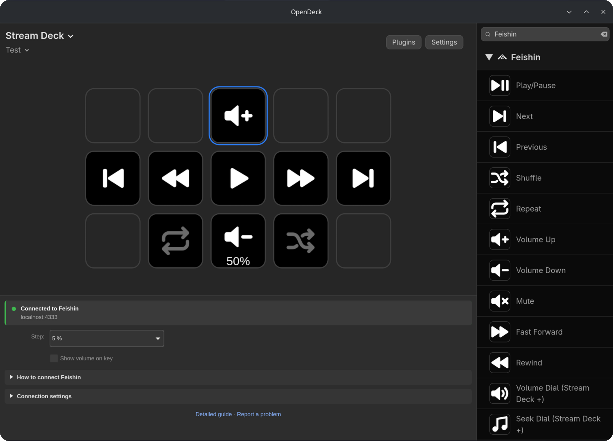

# Feishin Plugin for Elgato Stream Deck


Control your Feishin music playback directly from your Elgato Stream Deck!



<sub>Shown in [OpenDeck](https://github.com/nekename/OpenDeck) on Linux.</sub>

## Features

🎵 **Play/Pause**: Start or stop your music with a single tap.

⏭️ **Skip**: Jump to the next/previous track effortlessly.

⏩ **Fast Forward / Rewind**: Jump through the current track (5–60 seconds per press, hold to keep going).

🔊 **Volume**: Volume up/down (hold to keep going) and mute, with the current volume shown on the key.

🎛️ **Stream Deck +**: A volume dial and a seek dial that shows the current track and its progress on the touch strip.

🔀 **Shuffle**: Mix up your playlist for a fresh listening experience.

🔁 **Repeat**: Switch between repeat off, repeat all and repeat one.

🔌 **Guided setup**: Every action shows whether Feishin is connected and walks you through the setup if it isn't.

🌐 **Multilingual**: Full support for English and German.

## Installation

1. Download the latest release from the Elgato Marketplace [here](https://marketplace.elgato.com/product/feishin-d55fd48d-f102-4d21-83ce-bc1ea12beeba)

Requires Stream Deck 7.1 or later on Windows 10+ or macOS 12+, and the Feishin desktop app.

## Connecting Feishin

The plugin talks to Feishin's built-in remote control server. You'll find these steps (and the current connection status) in the settings of every Feishin action in the Stream Deck app, too.

1. Open Feishin and go to **Settings → Window → Remote**
2. Turn on **Enable remote control server**
3. Set the username to `feishin` and the password to `streamdeck`
4. Keep the port at `4333`

That's it – the status in the action settings turns green as soon as the plugin is connected.

Already using the remote control server with other credentials or a different port (or running Feishin on another computer)? Open the settings of any Feishin action in the Stream Deck app, expand **Connection settings** and enter your host, port, username and password there. They apply to all Feishin actions.

### Troubleshooting

The status at the top of the action settings tells you what's wrong:

| Status | What to do |
| --- | --- |
| **Feishin can't be reached** | Make sure Feishin is running and **Enable remote control server** is on. Check that the port matches the one in Feishin. |
| **Wrong username or password** | Use the same username and password in Feishin and in the plugin's connection settings. |
| **Can't connect to Feishin** | Something else answered on that port – check host and port. |

A key showing a warning triangle when pressed means the plugin couldn't send the command, usually because Feishin isn't connected.

Feishin only reports its volume after the volume changes. If the volume actions show a hint that the volume is unknown, change the volume in Feishin once – the plugin remembers it from then on.

## Usage

Simply drag and drop the desired Feishin actions onto your Stream Deck. Each button will display an icon representing its function. Actions with options (volume step, how far to jump, …) show them in their settings.

## Development

The plugin is built with the [Stream Deck SDK](https://docs.elgato.com/streamdeck/sdk/introduction/getting-started/) (Node.js, TypeScript).

```bash
npm install
npm run build        # builds de.felitendo.feishin.sdPlugin/bin/plugin.js
npx streamdeck link de.felitendo.feishin.sdPlugin   # installs the plugin in Stream Deck for development
npm run watch        # rebuilds and restarts the plugin on changes
npm run pack         # creates dist/de.felitendo.feishin.streamDeckPlugin
```

- `src/feishin.ts` – client for Feishin's remote control WebSocket
- `src/actions/` – the Stream Deck actions
- `de.felitendo.feishin.sdPlugin/ui/` – the settings shown in the Stream Deck app (property inspector)

## Support

If you encounter any issues or have suggestions for improvements, please [open an issue](https://github.com/Felodeck/Feishin-Plugin/issues) or contact me [here](mailto:support@felo.gg).

## Contributing

Contributions are welcome! Please feel free to submit a Pull Request.

## License

This project is licensed under the [GPL 3.0 license](LICENSE).
